# container-orchestration
# Лаба 1
## Часть 0
---
Ну тут пофиг, написал небольшой HTTP-сервис на Golang(main.go), только думал как лучше сделать выделение и удержание памяти, в итоге все сохраняется в общей памяти программы

## Часть 1
---
Запустили сервис напрямую в консоли, все работает, все кайф

Так же вот pid работающего сервиса в ps

## Часть 2
---
Тут уже началось общение с ИИшками, оч понравились правила из AGENTS.md, все прям разложилось по полочкам, хоть и заняло это значительно больше времени чем я думал

Я разбирал каждый namespace по отдельности, начнем-с
- `pid`      изолирует дерево процессов, т.е. процесс будет иметь pid 1 внутри своего    "контейнера" и видеть только свой список процессов
- `mount`    нужен, чтобы отделить файловую систему
- `net`      изолирует интерфейсы, routing table, iptables и т.д.
- `uts`      ставит свой hostname и domainname
- `ipc`      изолирует IPC-объекты (да ну??), это очереди сообщений, семафоры, разделяемую память хоста, кароче чтобы случайно (или нет) не мочь получить доступ к данным других сервисов
- `user`     изолирует отображение пользователей, чтобы процесс думал что он тут root, он тут главарь

С помощью unshare запускаем сервис, изолируя его по полной

На этом скрине видно, что у процесса pid 73420 на хосте

В unshare использованы флаги:
- -U (--user)
- -r (--map-root-user) нужен, чтобы текущий uid снаружи отображался как 0 внутри
- -m (--mount)
- -u (--uts)
- -i (--ipc)
- -n (--net)
- -p (--pid)
- -f (--fork) нужен, чтобы сменить PID namespace; создается потомок, который становится первым процессом в новом namespace, т.е. PID 1
- --mount-proc монтирует новый procfs для нового PID namespace, без него команды ps/top бы показывали чужие процессы

Внутрь контейнера заходим с помощью nsenter, он поключает к namespace-ам процесса.
На скринах видно, что процесс внутри имеет uid=0, его сеть пуста (там только `lo'), он root, имя хоста не вывело, на втором скрине поменяли hostname на lab1 и вызвав новый терминал, видим, что hostname поменялся.

Как я понял с помощью команды `cat /proc/sys/kernel/hostname` мы видим именно hostname внутри UTS namespace, а `/etc/hostname` показывает файл, который не меняется командой `hostname lab1`

Тут еще отдельно покажу, что все namespaces отличаются от хоста

## Часть 3
---
В этой части я сидел не знаю сколько точно, но точно часа 4-5, не получалось поймать OOM. Очень долго не мог понять как сделать так, чтобы память не освобождалась при попытках выйти за лимит...

Ну, начнем сначала, создали новую cgroup, на которую навесим необходимые лимиты. Назвали ее lab-memory, по предложению от ИИшки, типо только для лимитов по памяти, но дальше все вешалось на этот cgroup

Итак лучше проблемы с ООМ оставим на последок. Начнем с CPU, посмотрели что находится в cpu.max, там находятся два значения в формате (MAX PERIOD), т.е. сколько времени процессора может использовать процесс за назначенный период, было (max 100000), назначили половину ядра (50000 100000)

Дергаем `/burn` и видим что в `cpu.stat` показывается nr_throttled и throttled_usec
- `nr_throttled` это количество периодов, когда заданный лимит CPU был исчерпан и группа процессов была заблокирована
- `throttled_usec` это суммарное время блокировки группы процессов

Все это в микросекундах)

Далее задали `pids.max`=20, зачем-то запустил stress-ng на хосте и закинул их (9 процессов) в cgroup, сразу заметили, что в pid.events max быстро взлетело выше 30000, столько раз система отклонила создание новых процессов

Ну а почему в `pid.current` один раз показало 21 я не знаю, но могу предположить, что stress-ng успел создать fork и увеличить этот счетчик быстрее проверки, но больше этого числа не было

Итак, босс этой части, ограничение по памяти

По началу все шло прекрасно, задал лимит, начал пробовать дергать `/eat?mb=...` но уткнулся в то, что когда память была очень близко к лимиту и я хотел занять еще память, все сработало прекрасно и никакого ООМ не появилось...

В общем и целом, память тупо освобождалась в нужном количестве, без вылезания за лимит и без завершения нашего сервиса, занимающего эту память. Только увеличивался счетчик max в memory.events

Долговато поболтали с ИИшкой, в итоге было предложено установить параметр memory.swap.max=0, он отвечат за использование файла или раздела подкачки для выгрузки памяти, по сути мы запретили группе пытаться безопасно освобождать память и убивать каждый процесс, вышедший за лимит памяти

Ура, победа, долгожданный ООМ. В `memory.events` элементы oom oom_killed больше не ноль, они значат соответственно сколько раз были попытки выделить память и приведшие к срабатыванию ООМ, а также сколько процессов были завершены из-за ООМ

---

Мои ощущения после этого:

## Часть 4
---
Сначала поизучали что это ваще такое, зачем и как этим пользоваться
- `Capabilities` ограничивают полномочия процесса внутри ядра, что можно сделать и что нет
- `Seccomp` ограничивает уникальные системные вызовы

Они работают отдельно, поэтому начнем с Capabilities, их можно посмотреть в `/proc/{PID}/status`. Тут видно такие строчки как `CapInh CapPrm CapEff CapBnd CapAmb` 
- CapInh - привелегии для дочерних процессов
- CapPrm - максимальный набор привелегий, который процесс может себе установить
- CapEff - действительный набор этих привелегий, проверяемый ядром
- CapBnd - тут есть то, что процесс впринципе может получить
- CapAmb - то, что сохраняется при переходе между не-root пользователями

Для проверки использовали команду `capsh` с флагом `--drop`, которая скидывает перечисленные capability у запускаемого процесса(уберем возможность менять системное время). Таким образом запустили терминал и смотрим что нам выведет `capsh --print`

Среди списка нет того самого капабилити `CAP_SYS_TIME`, ура, пробуем поменять время и, как и ожидалось, низя такое делать, значит работает

---

Далее снова будем издеваться над терминалом, нужно запустить процесс с seccomp профилем, запрещающем что нибудь для проверки

Используем systemd-run, чтобы это сделать, флаг `-t` (--pty) нужен, чтобы запустить псевдотерминал и соединить его с текущим терминалом, а `-p` (--property) как раз навешивает свойство, в нашем случае seccomp-фильтр, в который мы передали `~ptrace`, т.е. запретили использовать syscall ptrace

Далее пробуем вызвать этот syscall с помощью strace, и наблюдаем ошибку `Bad system call ...`. Это то, что нам нужно, фильтр сработал

## Часть 5
---
Ну так, с чего бы начать, написать скрипт было еще той проблемой, я лично пытался разобраться как успеть везде, используя systemd-run для seccomp-профиля. Это было ошибкой, но такая мысль пришла мне в голову только после 6 часов страданий и нормально не работающего скрипта :))))))

Поискав еще несколько вариантов, остановился на варианте с отдельной программой на питоне (wrapper.py), которая навесит тот самый seccomp-профиль и все будет чики-пуки

Теперь все работает, все есть

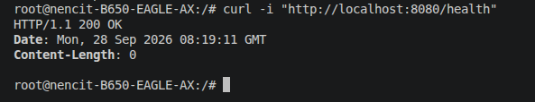

С докером все норм, его запускали еще до 2 части

Так, а чем же отличаются наша версия с оригиналом?

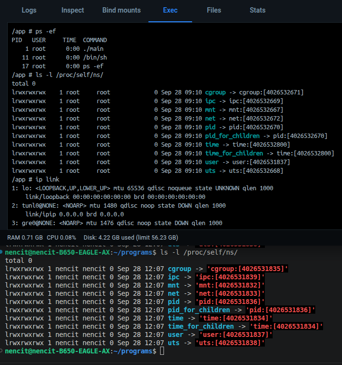
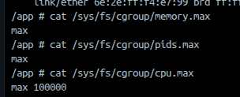
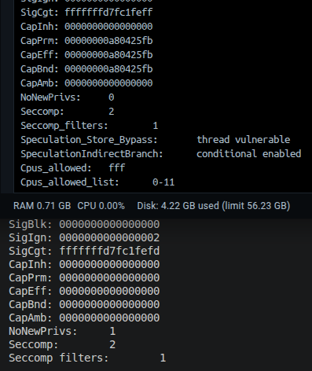

Из скринов видно, что namespace в докере изолированы, по cgroup ограничений не замечено, в докере имеется свой набор capabilities, а мы его полностью убрали.

Так же видно, что в докере есть seccomp, по скрину одинаковый с нашим, но по идее он использует свою runtime security policy, которая уже содержит собственный seccomp-профиль.

Попробую свести в табличку

| Возможность               |    `mydocker.sh` |                  Docker |
| ------------------------- | ---------------: | ----------------------: |
| namespaces                |               ✅ |                       ✅ |
| cgroup limits             |               ✅ | как понял, можно задать отдельно |
| capabilities              |               ✅ |  свой набор (черный список) |
| seccomp                   |               ✅ |          тоже свой профиль |
| образы                    |               ❌ |                       ✅ |
| создание виртуальной сети |          вручную |                       ✅ |
| port publishing           |          вручную |                       ✅ |
| filesystem/image          |               ❌ |                       ✅ |
| container root filesystem |               ❌ |                       ✅ |
| volume management         |               ❌ |                       ✅ |
| lifecycle management      |         частично |                       ✅ |
| logging                   |               ❌ |                       ✅ |

## Часть 6
---

Ну тут собрали сначала базовый образ, потом еще два с мульти-стэйдж (alpine и scratch)
По отличиям у них:

- обычный образ ОООЧЕНЬ большой в сравнении с мульти-стэйдж
- с помощью `docker history` увидели, что слоев меньше примерно в 2-3 раза
- при повторной сборке видно что переиспользовалось из кэша - строчки `CACHED`

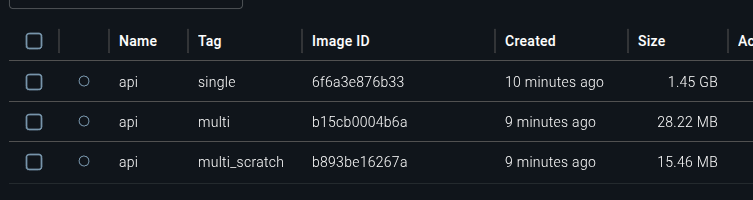
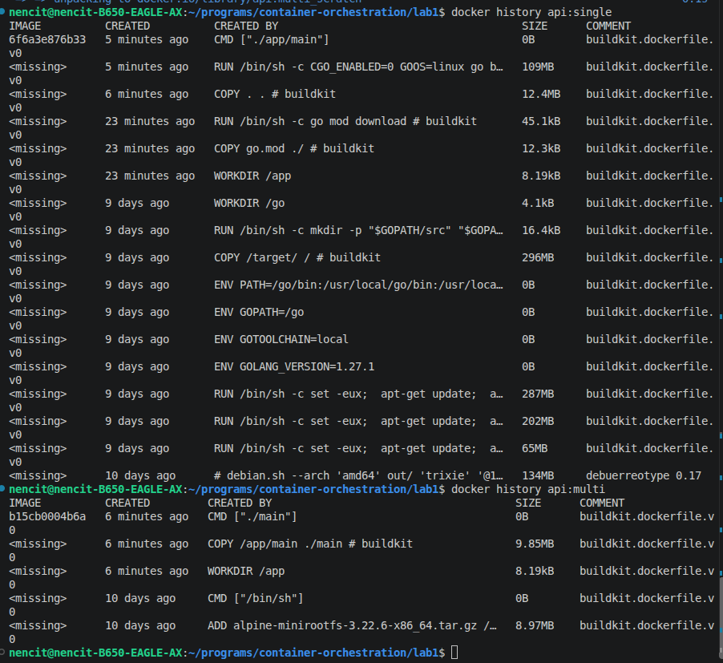
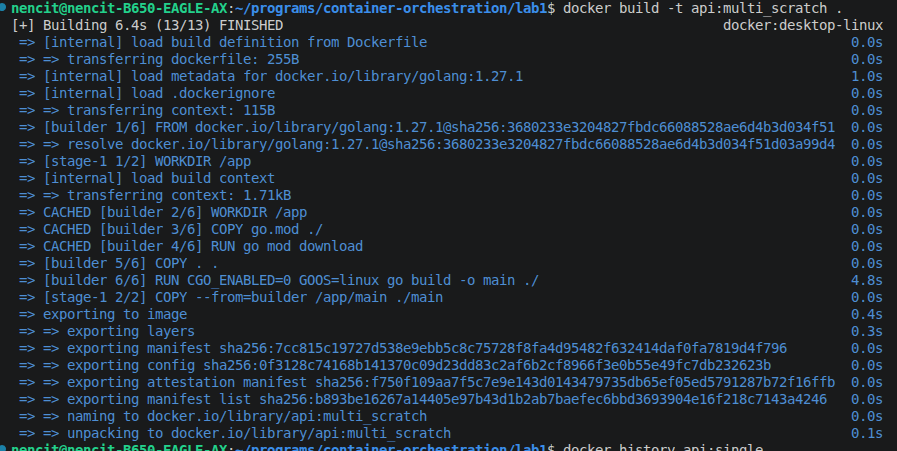

Далее экспериментируем с созданием файла внутри контейнера, сначала тупо записали .txt файл в контейнер и пересоздали его. А где же наш файл? а нету его, дизентегрировал, анлак

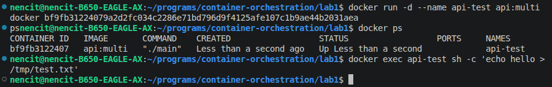
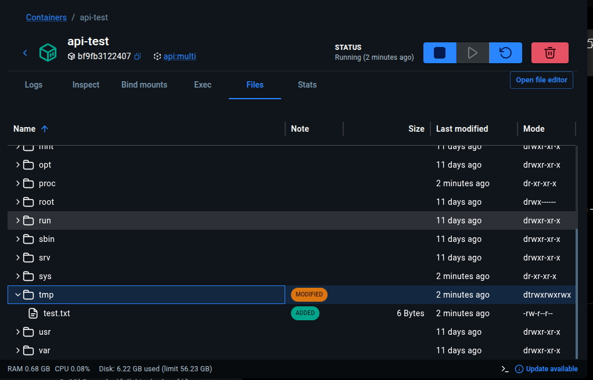
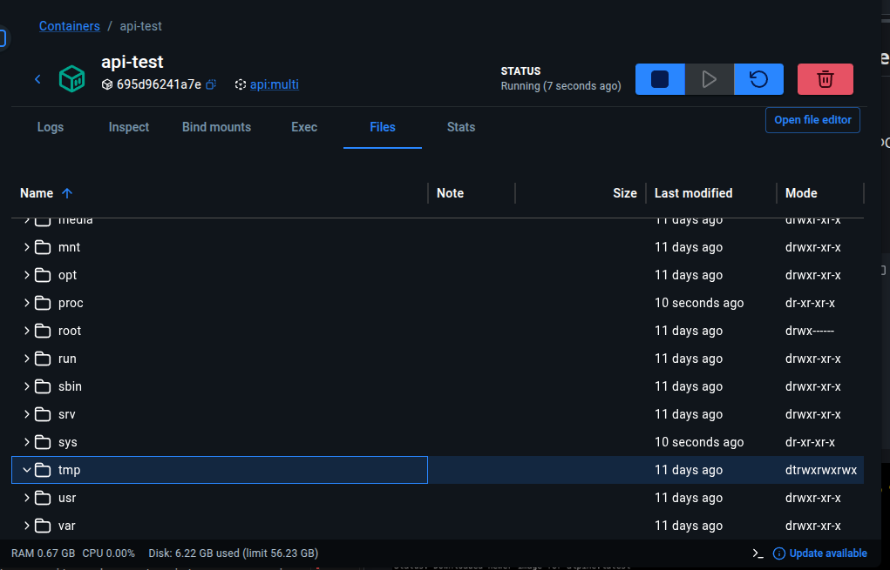

---
Теперь пробуем создать том, указать его контейнеру и создать такой же файл там, потом пересоздаем контейнер с новым названием, указывая ему этот же том, опа, файлик остался

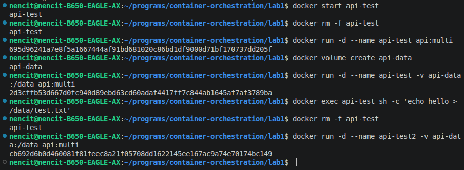
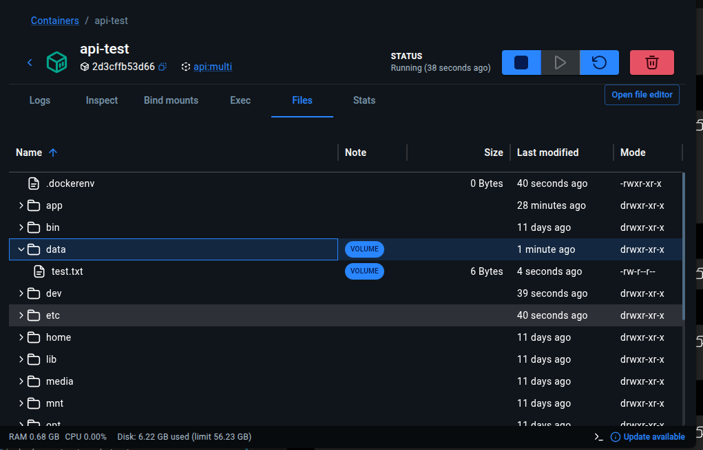
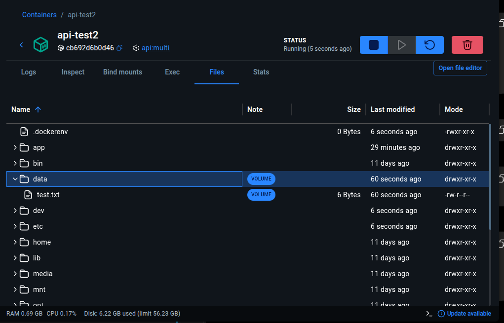

## Часть 7
---

## Часть 8
---
