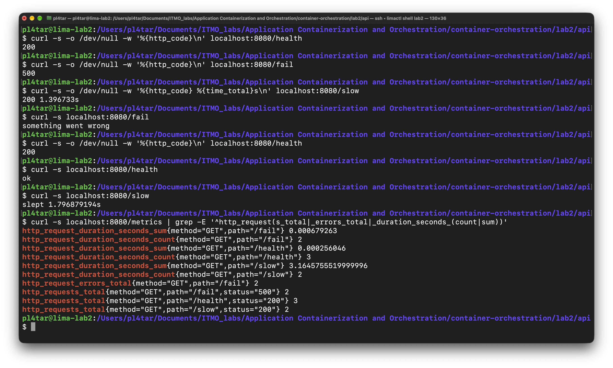
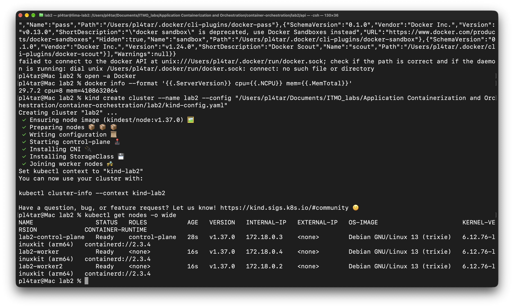
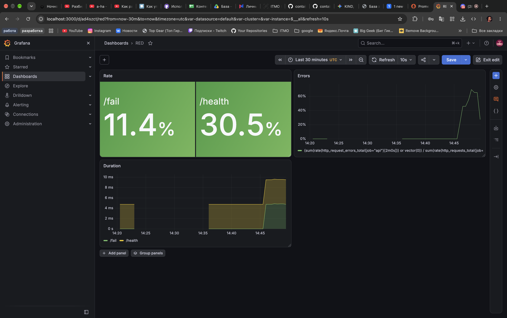
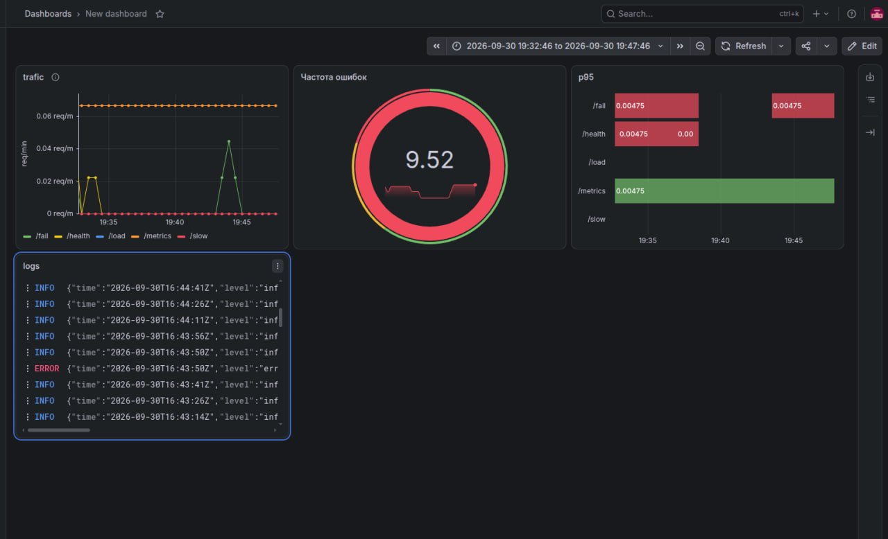
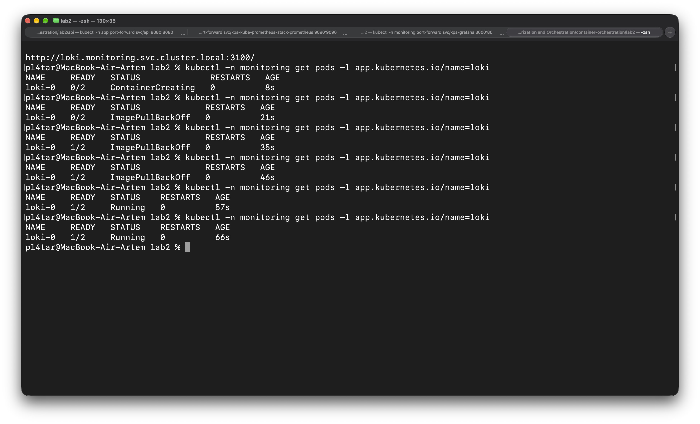
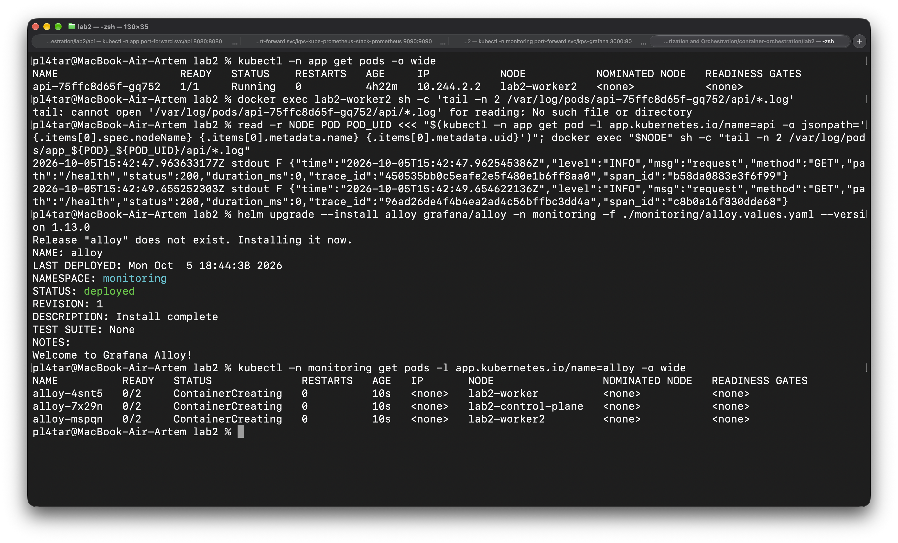

# Лаба 2

Мониторинг сервиса `api` в Kubernetes: метрики, логи, трейсы, алерты. Всё развёрнуто через Helm в локальном кластере kind. По сути у нас есть сервис и два независимых канала наблюдающие за ним, которые складывают статистику в Grafana.

## Часть 0 — сервис и кластер

Навайбкодили простой сервис на Go, и на скрине дернули все ручки. 




По пути `/metrics` собраны метрики для дашборда RED. 


Потом мы ставили **kind** вместо **minikube** (словили спойлер от одногруппника, что нельзя будет с миникубом уронить сервис в 3 лабе).  
Также мы разместили 3 ноды



ниже вариант Данила: кластер из одной ноды, сервис выкачен через kubectl apply


## Часть 1 — метрики (Prometheus + Grafana)
Используем helm, удобно загружаем чарт с нужным нам прометеусом и т.д. - kube-prometheus-stack, в нём пришло одним релизом полная система мониторинга кластера. \
Там Grafana, Promrteus, Alertmanager и тд.  
Prometheus узнаёт о сервисе по такой цепочке: ServiceMonitor → оператор → конфиг → scrape по IP пода.
Т.е. у нас в чарте сервиса, в нашем случае `api`, лежит ServiceMonitor, который преедает запись что и как с метриками сервиса в API кубика (оператор) и уже тот передает конфиг в Prometeus. 

Источники данных в Grafana — Prometheus подключён самим чартом, через ConfigMap и sidecar.


цель api в состоянии UP, скрейп идёт на IP пода 


ряды http_requests_total: лейблы namespace, pod, job, instance дописал Prometheus


### Дашборд RED

Ниже предсталвены варианты графаны от нас двоих, но тут признаю, Данил выбрал более удачное отоброжение метрик, правда ошибки подкачали, я бы свой вариант оставил. 

  
  

Дашборд лежит в репозитории файлом `charts/api/dashboards/red.json`.  
>Почему сохранили файлом, а не через интерфейс?  

Сохранённый руками дашборд живёт во внутренней базе Grafana, а у неё нет постоянного диска после рестарта пода он исчезнет, рил была такая проблема, пришлось смотреть как сохранять. И его можно будет схоранить в репозитории, то есть его можно сдать и восстановить на новом кластере)  

**Grafana такая после рестарта:**  


## Часть 2 — логи (Loki + Grafana)

Как я понял: `Loki` — это только хранилище, которое принимает строки по HTTP и отвечает на запросы, сам ничего не собирает. Собирает `Alloy` — агент, который стоит на каждой ноде.  

Установка:  
  
<!--  -->

Путь одной строки:  
сервис пишет JSON в stdout
containerd записывает его в файл на диске ноды, /var/log/pods/<namespace>_<под>_<UID>/api/0.log, дописывая в начало время и имя потока  
Alloy на этой ноде читает файл, срезает префикс и отправляет строку в Loki 
Loki сохраняет её, Grafana достаёт запросом

<!-- Конфиг — это конвейер из пяти блоков:  
**discovery.relabel** — превращает данные о поде в лейблы и в путь к файлу лога;  
**loki.source.file** — читает найденные файлы;  
**loki.process со стадией cri** — убирает префикс containerd, оставляя исходную строку сервиса;   
**loki.write** — отправляет в Loki.  

Лейблов пять: namespace, pod, container, app, node. Loki строит индекс только по лейблам, и каждое уникальное их сочетание — отдельный поток. У trace_id значение новое на каждый запрос: сделай его лейблом, и потоков станет столько же, сколько запросов, индекс распухнет. Поэтому он остаётся в тексте строки и ищется при запросе. -->

В Go есть библеотека slog (ну точнее она стала стандартной в этом году, но да как бы спасибо разработчикам все дела), которая нам помогает выводить все в виде логов без лишних заморочек)

Запрос LogQL
{namespace="app", app="api"} | json | level="ERROR"




Метрики и логи в одном окне: на дашборд к панелям RED добавлена панель с логами из Loki. Всплеск на графике ошибок и строка ERROR в логах видны рядом, на одной шкале времени.


## Часть 3 — трейсы (OpenTelemetry + Jaeger)
---

Метрики и логи у сервиса забирают снаружи, а Prometheus сам ходит на `/metrics`, Alloy сам читает файл на ноде. С трейсами все происходит по другому сервис сам отправляет спаны, поэтому ему нужно сказать адрес.

Список трейсов сервиса `api` за час: `GET /slow` с двумя спанами и длительностью 1.0s, `GET /fail` с одним спаном и отметкой ошибки.`GET /metrics` каждые 15 секунд: это скрейпы Prometheus, они тоже попадают в трейсы.


Дернули `/slow`, получили двухэтажный водопад


Трейс `/fail` один спан. помечен ошибкой `error=true`, `error.type=intentional`, `http.status_code=500`.


Связка лог → трейс: в Loki строка ERROR от `/fail` за 21:53:39.033 с `trace_id=df5a06223ae6c3aa1aa9ec4cb680f910`. Трейс на скриншоте выше открыт поиском по этому же id, время начала совпадает до миллисекунды.


## Часть 4 — алерты (Alertmanager + Karma)
---

Ну тут решили сделать так, чтобы алерты приходили, через тг бота, создали бота, взяли его токен, ID чата и пошли переносить это все в конфиг для алерт мэнеджера

А так, сначала положили токен бота в секрет
``` bash
kubectl create secret generic alertmanager-tg \
  -n monitoring \
  --from-literal=bot_token='<TOKEN>'
```

Создали и применили конфиг для Alertmanager и написали 3 алерта, с которыми будем работать

Небольшая справочка,
Как правило из PromQL доходит до получателя:
1) сначала создается CRD от Prometheus Operator: `PrometheusRule`, оператор видит его по метке и подсовывает в конфиг прометеуса
2) Прометеус каждые 30 секунд проверяет выражения из правил и в случае срабатывания правило переходит в состояние `Firing`
3) Потом прометеус отправляет алерт в Alertmanager, который рассылает алерты уже получателям
4) получатель - это telegram, в конфиге описан ресивер, там токен бота и айди чата, маршрут (`route`) со своим `receiver` и матчерами. И alertmanager шлет запрос в телеграм

### Три критичных алерта

Взяли 3 базовых алерта:
- ApiDown - сервис упал, тут без комментариев все плохо
- ApiHighErrorRate - много ошибок за последние 5 минут (>5% запросов)
- ApiHighLatency - если p95 > 2 секунд, запросы долгие, надо что то делать, теряем клиентов

все алерты сделали severity critical, хотя последний можно было сделать warning


Далее пробуем вызвать алерт, накидываем кучу /fail, вырубаем реплику или много /slow
Тут были проблемы с отправкой в тг, короче оператор подставлял там namespace в конфиг, что не давало пройти нашим алертам дальше, отключили эту автодобавление

В алерт менеджере firing не увидели, но все прилетело в телеграм

Там еще была куча алертов от kube-prometheus-stack, для нас это пока по сути alert fatigue


Также запустили karma, ваще очень круто и удобнее визуально:


