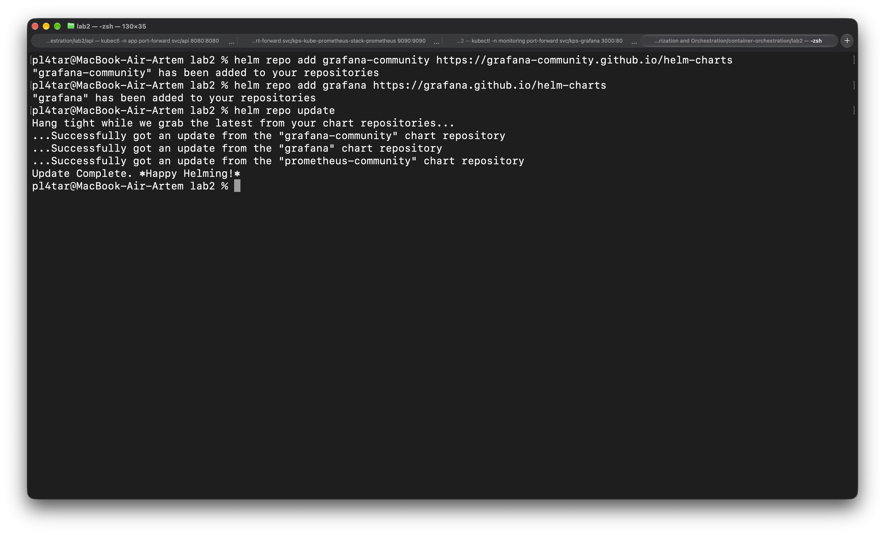

# Лаба 2

Мониторинг сервиса `api` в Kubernetes: метрики, логи, трейсы, алерты. Всё развёрнуто через Helm в локальном кластере kind. По сути у нас есть сервис и два независимых канала наблюдающие за ним, которые складывают статистику в Grafana.

## Часть 0 — сервис и кластер

Навайбкодили простой сервис на Go, и на скрине дернули все ручки. 

По пути `/metrics` собраны метрики для дашборда RED. 

Потом мы ставили **kind** вместо **minikube** (словили спойлер от одногруппника, что нельзя будет с миникубом уронить сервис в 3 лабе). Также мы разместили 3 ноды, по требованиям из задания. 

## Часть 1 — метрики (Prometheus + Grafana)
<!-- TODO: что такое kube-prometheus-stack и что в нём пришло одним релизом -->

<!-- TODO: как Prometheus узнаёт о сервисе: ServiceMonitor → оператор → конфиг → scrape по IP пода.
     Какой селектор ServiceMonitor выбрал и почему -->

<!-- TODO: скриншот цели api в состоянии UP (Status → Target health) -->

### Дашборд RED

| Панель | Запрос | Что показывает |
|---|---|---|
| Rate | <!-- TODO --> | |
| Errors | <!-- TODO --> | |
| Duration | <!-- TODO --> | |

<!-- TODO: как дашборд доставляется в Grafana (ConfigMap + sidecar) и почему не через интерфейс -->

<!-- TODO: что делал для нагрузки (/load, /fail, /slow) и как отреагировали графики -->
Ниже предсталвены варианты графаны от нас двоих, но тут признаю, Данил выбрал более удачное отоброжение метрик, правда ошибки подкачали, я бы свой вариант оставил. 

## Часть 2 — логи (Loki + Grafana)
---
<!-- TODO: разделение ролей: Loki хранит, Alloy собирает. Путь строки от stdout до Grafana -->

<!-- TODO: что делает конфиг Alloy по шагам, какие лейблы назначаются и почему trace_id не лейбл -->

<!-- TODO: запрос LogQL, которым нашёл ошибку от /fail -->

## Часть 3 — трейсы (OpenTelemetry + Jaeger)
---
<!-- TODO: как сервис инструментирован, куда и по какому протоколу уходят спаны -->

<!-- TODO: скриншот водопада /slow с вложенным спаном slow-op -->

<!-- TODO: скриншот трейса /fail с ошибочным спаном -->

<!-- TODO: переход от строки лога в Grafana к трейсу в Jaeger по trace_id — скриншоты обеих сторон -->

## Часть 4 — алерты (Alertmanager + Karma)
---
<!-- TODO: как правило из PromQL доходит до получателя: Prometheus → Alertmanager → получатель -->

### Три критичных алерта

| Алерт | Что ловит | Почему это важно | Что делать дежурному |
|---|---|---|---|
| <!-- TODO --> | | | |
| <!-- TODO --> | | | |
| <!-- TODO --> | | | |

<!-- TODO: как спровоцировал каждый алерт -->

<!-- TODO: скриншот алертов в firing в Alertmanager -->

<!-- TODO: скриншот тех же алертов в Karma -->

## Итог
---
<!-- TODO: сквозная проверка: жму /load, /fail, /slow → что вижу на дашборде, в логах, в Jaeger, в алертах -->

<!-- TODO: что было неочевидным и на чём застревал -->
