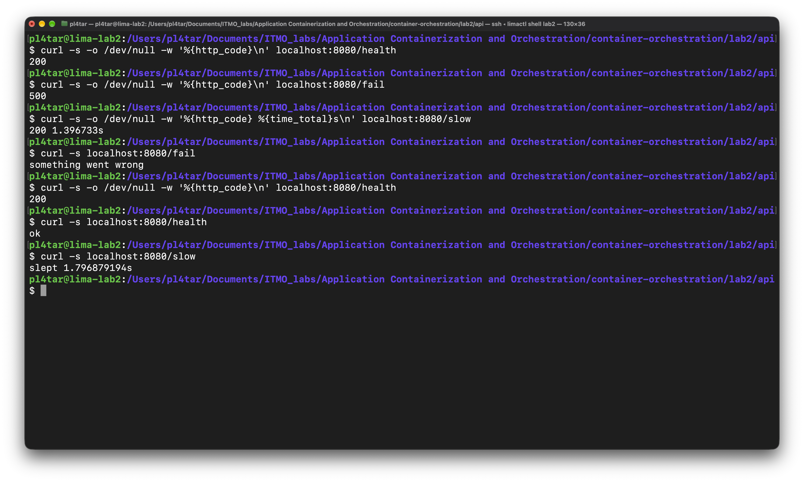
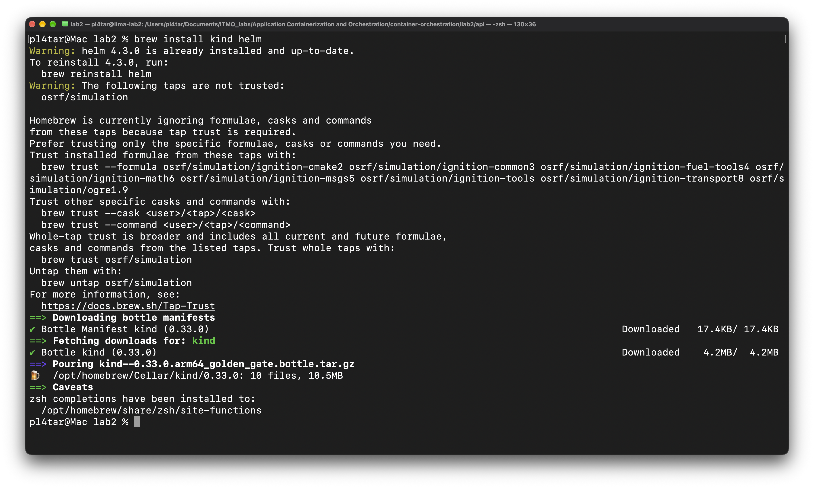
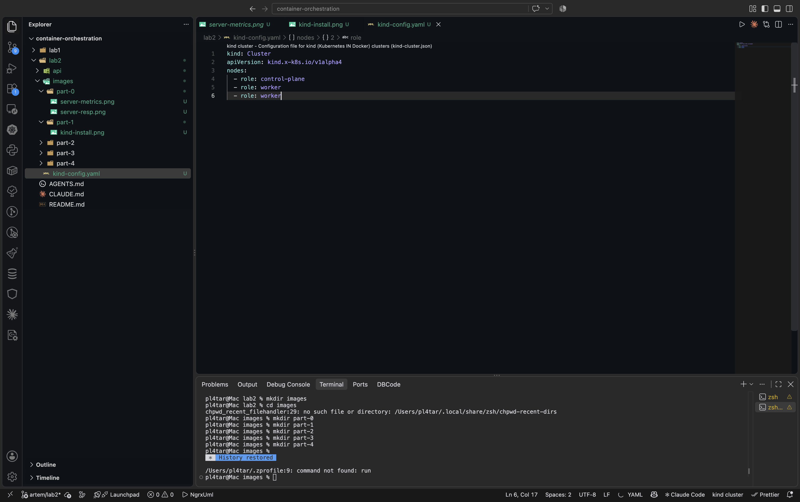

# Лаба 2

Мониторинг сервиса `api` в Kubernetes: метрики, логи, трейсы, алерты. Всё развёрнуто через Helm в локальном кластере kind.

<!-- TODO: 2–3 предложения своими словами — что в итоге получилось и что с чем связано -->

## Что где лежит

| Путь | Что это |
|---|---|
| `api/` | код сервиса и Dockerfile |
| `kind-config.yaml` | конфиг кластера: control-plane + 2 worker |
| `charts/api/` | Helm-чарт сервиса: Deployment, Service, ServiceMonitor, дашборд RED |
| `monitoring/kube-prometheus-stack.values.yaml` | Prometheus, Alertmanager, Grafana |
| `monitoring/loki.values.yaml` | Loki |
| `monitoring/alloy.values.yaml` | агент сбора логов |
| `images/` | скриншоты |

<!-- TODO: дописать строки для Jaeger, правил алертов и Karma, когда появятся -->

## Как поднять с нуля

Все команды — из каталога `lab2`.

```bash
kind create cluster --name lab2 --config kind-config.yaml

docker build -t api:0.1.0 ./api
kind load docker-image api:0.1.0 --name lab2

helm repo add prometheus-community https://prometheus-community.github.io/helm-charts
helm repo add grafana-community https://grafana-community.github.io/helm-charts
helm repo add grafana https://grafana.github.io/helm-charts
helm repo update

helm upgrade --install kps prometheus-community/kube-prometheus-stack -n monitoring --create-namespace \
  -f ./monitoring/kube-prometheus-stack.values.yaml --version 91.9.0
helm upgrade --install loki grafana-community/loki -n monitoring \
  -f ./monitoring/loki.values.yaml --version 18.13.8
helm upgrade --install alloy grafana/alloy -n monitoring \
  -f ./monitoring/alloy.values.yaml --version 1.13.0

helm upgrade --install api ./charts/api -n app --create-namespace
```

<!-- TODO: дописать установку Jaeger и Karma -->

## Часть 0 — сервис и кластер
---
<!-- TODO: пара слов про сервис: на чём написан, какие эндпоинты, что отдаёт на /metrics, в каком виде пишет логи -->




<!-- TODO: почему kind, зачем три ноды, как образ попадает в кластер (kind load) и почему тег не latest -->






<!-- TODO: что в чарте api и зачем именованный порт и лейблы -->

## Часть 1 — метрики (Prometheus + Grafana)
---
<!-- TODO: что такое kube-prometheus-stack и что в нём пришло одним релизом -->

<!-- TODO: как Prometheus узнаёт о сервисе: ServiceMonitor → оператор → конфиг → scrape по IP пода.
     Какой селектор ServiceMonitor выбрал и почему -->

<!-- TODO: скриншот цели api в состоянии UP (Status → Target health) -->

### Дашборд RED

| Панель | Запрос | Что показывает |
|---|---|---|
| Rate | <!-- TODO --> | |
| Errors | <!-- TODO --> | |
| Duration | <!-- TODO --> | |

<!-- TODO: как дашборд доставляется в Grafana (ConfigMap + sidecar) и почему не через интерфейс -->

<!-- TODO: что делал для нагрузки (/load, /fail, /slow) и как отреагировали графики -->


## Часть 2 — логи (Loki + Grafana)
---
<!-- TODO: разделение ролей: Loki хранит, Alloy собирает. Путь строки от stdout до Grafana -->


<!-- TODO: что делает конфиг Alloy по шагам, какие лейблы назначаются и почему trace_id не лейбл -->

<!-- TODO: запрос LogQL, которым нашёл ошибку от /fail -->


## Часть 3 — трейсы (OpenTelemetry + Jaeger)
---
<!-- TODO: как сервис инструментирован, куда и по какому протоколу уходят спаны -->

<!-- TODO: скриншот водопада /slow с вложенным спаном slow-op -->

<!-- TODO: скриншот трейса /fail с ошибочным спаном -->

<!-- TODO: переход от строки лога в Grafana к трейсу в Jaeger по trace_id — скриншоты обеих сторон -->

## Часть 4 — алерты (Alertmanager + Karma)
---
<!-- TODO: как правило из PromQL доходит до получателя: Prometheus → Alertmanager → получатель -->

### Три критичных алерта

| Алерт | Что ловит | Почему это важно | Что делать дежурному |
|---|---|---|---|
| <!-- TODO --> | | | |
| <!-- TODO --> | | | |
| <!-- TODO --> | | | |

<!-- TODO: как спровоцировал каждый алерт -->

<!-- TODO: скриншот алертов в firing в Alertmanager -->

<!-- TODO: скриншот тех же алертов в Karma -->

## Итог
---
<!-- TODO: сквозная проверка: жму /load, /fail, /slow → что вижу на дашборде, в логах, в Jaeger, в алертах -->

<!-- TODO: что было неочевидным и на чём застревал -->
